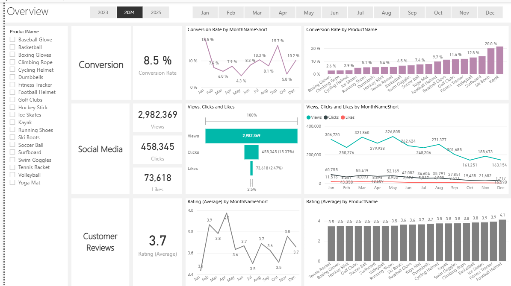
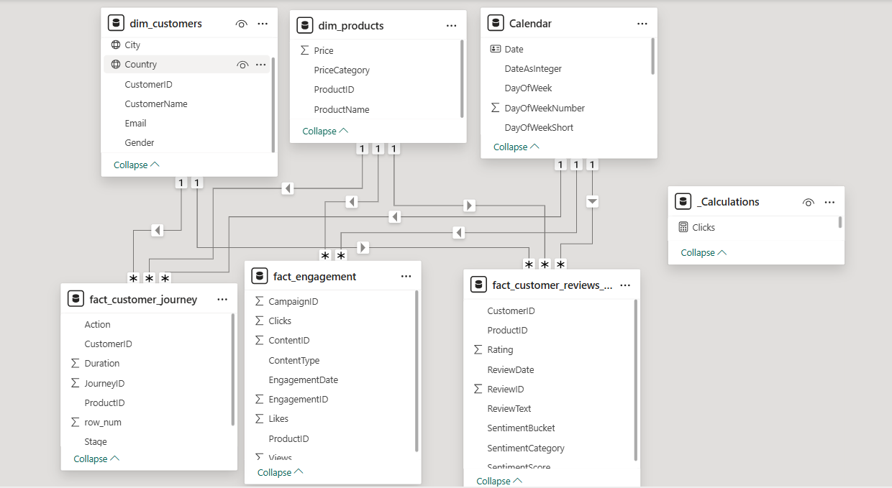
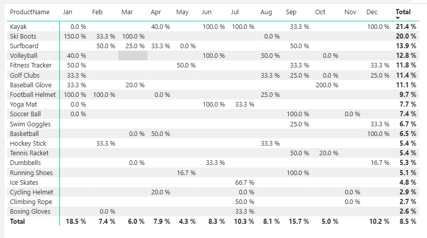
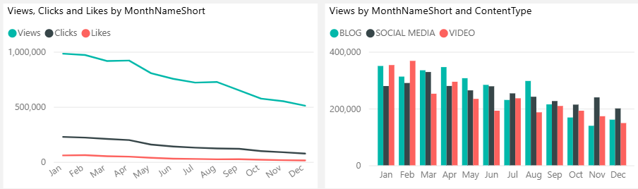
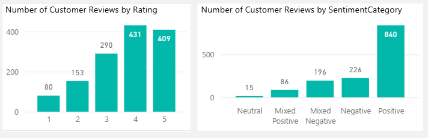

# 🛒 Marketing Analytics Business Case


## Project Overview

This project tackles the marketing challenges faced by **ShopEasy**, an online retail business, experiencing:
- 📉 Reduced customer engagement
- 🔻 Decreased conversion rates
- 💰 High marketing expenses without returns

The aim is to conduct an in-depth analysis to provide **actionable insights** for optimizing their marketing strategies and improving overall performance.

---

## 🚩 Problem Statement

### Key Issues
- **Reduced Customer Engagement**: Fewer interactions with site and marketing content.
- **Low Conversion Rates**: Fewer visitors are converting to paying customers.
- **High Marketing Costs**: Increased investment in marketing without yielding expected returns.
- **Lack of Customer Feedback Analysis**: Customer opinions are not being fully utilized to improve marketing.

---

## 🎯 Project Goals

### 🧠 **Increase Conversion Rates**
- **Goal**: Understand factors influencing conversions.
- **Insight**: Identify key stages where users drop off and suggest improvements to the funnel.

### 🎥 **Enhance Customer Engagement**
- **Goal**: Analyze types of content driving the most engagement.
- **Insight**: Study customer interaction patterns with marketing content.

### 💬 **Improve Customer Feedback Scores**
- **Goal**: Extract themes from customer reviews for actionable insights.
- **Insight**: Focus on positive and negative recurring feedback.

---

## 📊 Key Performance Indicators (KPIs)




- **Conversion Rate**: Percentage of site visitors who complete a purchase.
- **Engagement Rate**: Interactions with content (clicks, likes, comments).
- **Average Order Value (AOV)**: The average amount spent per transaction.
- **Customer Feedback Score**: Average rating from customer reviews.

---

## 📈 Data Sources




1. **Customer Reviews**: Analyzing feedback for sentiment and themes.
2. **Social Media Metrics**: Understanding engagement trends.
3. **Campaign Performance Metrics**: Evaluating marketing campaign efficiency.

---

## 🔍 Analytical Approach

1. **Conversion Funnel Analysis**: Analyze user behavior at each stage to improve drop-offs.
2. **Sentiment Analysis**: Understand common themes in customer feedback.
3. **Content Performance**: Analyze the performance of different types of marketing content.
4. **Marketing Campaign Analysis**: Evaluate the success of each campaign in driving conversions.

---

## 📑 Key Findings

### 1. **Conversion Rates**
   - Conversion rates peaked in **December** at 10.2%, rebounding from October's low of 5.0%.
   - Seasonal product demand (e.g., Ski Boots) drove **150% conversion** in January.

  


### 2. **Customer Engagement**
   - Engagement peaked in **February** but declined from **August** onwards.
   - Blog content led engagement, while video content was stable but less interactive.




### 3. **Customer Feedback**
   - Average customer rating: **3.7**, slightly below the 4.0 target.
   - **140 reviews** at 4 stars, and **135 reviews** at 5 stars, indicating overall satisfaction.

  


---

## 📝 Recommendations

### 1. **Increase Conversion Rates**
   - 📊 **Target high-performing products** (e.g., Ski Boots) with focused promotions during peak seasons.
   
### 2. **Enhance Customer Engagement**
   - 🔄 **Revamp content strategy**: Experiment with engaging formats like **interactive videos** and **user-generated content**.

### 3. **Improve Customer Feedback**
   - 📧 **Address mixed reviews**: Follow up with customers to resolve issues and improve ratings.

---

## 🛠️ Future Work

1. Implement **Machine Learning** models to predict customer behavior.
2. Conduct **A/B testing** to refine marketing strategies.
3. Develop an **automated feedback system** to respond to customer reviews in real time.

---

## 📂 Project Structure

```bash
├── data/                   # Raw and processed data files
├── notebooks/              # Jupyter Notebooks used for analysis
├── images/                 # Visual assets for the report and README
├── src/                    # Source code for data processing
├── reports/                # Final analysis reports and presentations
└── README.md               # Project overview and documentation
